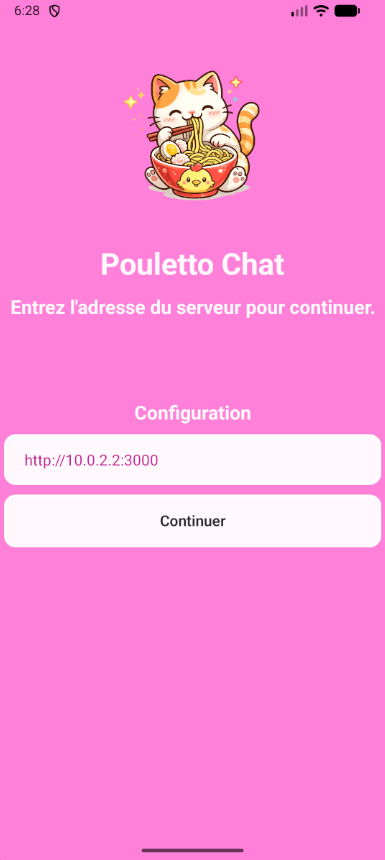
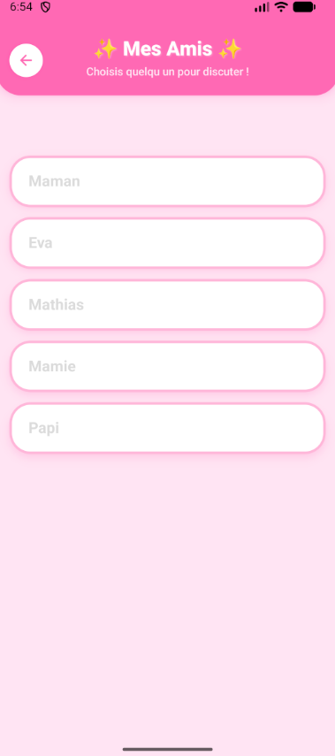
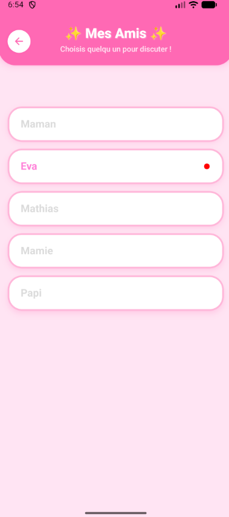
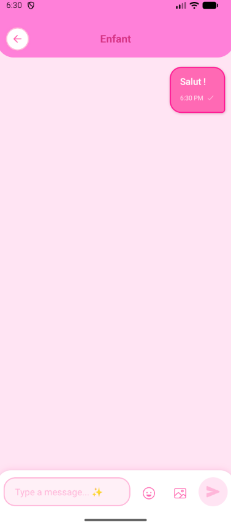
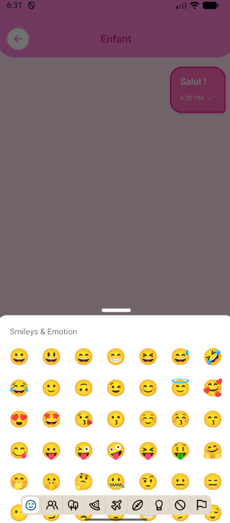

# 🐔 Pouletto Chat

<p align="center">
  
</p>

> Application de messagerie Android auto-hébergée avec un serveur Docker.

> 🇬🇧 [Read in English](#-pouletto-chat--english-guide)

## Table des matières

- [Introduction](#-introduction)
- [Pré-requis](#-pré-requis)
- [Récupérer le projet](#-récupérer-le-projet)
- [Installer Docker Desktop](#-installer-docker-desktop)
- [Configurer le fichier .env](#-configurer-le-fichier-env)
- [Lancer le serveur](#-lancer-le-serveur)
- [Trouver l'adresse IP de sa machine](#-trouver-ladresse-ip-de-sa-machine)
- [Créer des utilisateurs](#-créer-des-utilisateurs)
- [Installer l'APK sur Android](#-installer-lapk-sur-android)
- [Configurer l'URL du serveur dans l'app](#-configurer-lurl-du-serveur-dans-lapp)
- [Se connecter](#-se-connecter)
- [Problèmes connus](#-problèmes-connus)
- [Arrêter / relancer le serveur](#-arrêter--relancer-le-serveur)
- [Configuration avancée](#-configuration-avancée)

---

## 🐔 Introduction

**Pouletto Chat** est une application de messagerie Android en temps réel que vous hébergez vous-même sur votre propre ordinateur. Tous les messages restent sur votre machine — pas de cloud, pas de service tiers.

Vous aurez besoin de :
- Un PC pour faire tourner le serveur (doit rester allumé pendant que les gens veulent tchatter)
- Des téléphones Android pour les utilisateurs

<p align="center">
  
  
  
  
  
</p>

---

## ✅ Pré-requis

- Un PC sous **Windows**, **macOS** ou **Linux** avec au moins **4 Go de RAM**
- Un ou plusieurs **smartphones Android**
- Tout le monde doit être sur le **même réseau local** (même box Wi-Fi ou réseau filaire)

---

## 📥 Récupérer le projet

**Option A — Avec un compte GitHub :**

Ouvrez un terminal, allez là où vous voulez mettre le projet, et tapez :

```bash
mkdir pouletto-chat
cd pouletto-chat
git clone https://github.com/soutade/pouletto-chat.git .
```

**Option B — Sans compte GitHub :**

1. Allez sur la page du dépôt sur GitHub
2. Cliquez sur le bouton vert **Code** → **Download ZIP**
3. Extrayez le fichier ZIP quelque part sur votre PC (ex : Bureau)
4. Ouvrez le dossier extrait

---

## 🐳 Installer Docker Desktop

Docker est le programme qui fait tourner le serveur. Il ne s'installe qu'une seule fois.

1. Téléchargez Docker Desktop : https://www.docker.com/products/docker-desktop/
2. Suivez le guide d'installation pour votre système : https://docs.docker.com/desktop/
3. Après l'installation, **lancez Docker Desktop**
4. Vous devriez voir l'icône de baleine Docker dans votre barre des tâches (Windows) ou barre de menu (Mac) — cela signifie qu'il tourne

> Docker doit être lancé à chaque fois que vous voulez démarrer le serveur.

---

## ⚙️ Configurer le fichier .env

Le fichier `.env` contient vos mots de passe et clés secrètes. Il faut le créer avant de démarrer le serveur.

1. Ouvrez le dossier `pouletto-chat/` (la racine du projet)
2. Trouvez le fichier appelé `.env.example`
3. **Faites-en une copie** et renommez cette copie en `.env` (dans le même dossier)
4. Ouvrez `.env` avec un éditeur de texte (Bloc-notes, TextEdit, etc.) et remplissez les valeurs :

```
DB_HOST=db                      <- laisser tel quel (nom interne Docker)
DB_USER=pouletto                 <- nom d'utilisateur de la base de données (au choix)
DB_PASSWORD=changeme             <- mot de passe de la base de données (choisissez quelque chose de fort)
DB_ROOT_PASSWORD=changeme_root   <- mot de passe admin de la base (choisissez quelque chose de fort)
DB_NAME=pouletto-chat            <- laisser tel quel
JWT_SECRET=changeme_secret       <- clé secrète, utilisez une longue chaîne aléatoire (32+ caractères)
JWT_EXPIRES_IN=90d               <- laisser tel quel
```

Conseil pour les mots de passe forts : mélangez majuscules, minuscules, chiffres et symboles.
Exemple : `Tr0ub4dor&3`

Ne partagez jamais votre fichier `.env` — il contient des informations sensibles.

---

## 🚀 Lancer le serveur

Ouvrez un terminal, naviguez dans le dossier `pouletto-chat/` (la racine du projet) et tapez :

```bash
docker compose up -d
```

- Le `-d` signifie "lancer en arrière-plan" (vous pouvez fermer le terminal après)
- La première fois, Docker va télécharger et construire le serveur — cela peut prendre quelques minutes

**Vérifier que tout tourne :**

```bash
docker compose ps
```

Vous devriez voir deux services avec le statut `running` : `db` et `backend`.

Vous pouvez aussi ouvrir Docker Desktop et voir les deux conteneurs en vert.

**Voir les logs du serveur (optionnel) :**

```bash
docker compose logs -f backend
```

Appuyez sur `Ctrl+C` pour arrêter de suivre les logs.

---

## 🌐 Trouver l'adresse IP de sa machine

Votre téléphone a besoin de connaître l'adresse de votre PC sur le réseau local.

**Windows :**

1. Ouvrez le menu Démarrer, cherchez **"cmd"** et ouvrez-le
2. Tapez `ipconfig` et appuyez sur Entrée
3. Cherchez **"Adresse IPv4"** sous votre adaptateur Wi-Fi ou Ethernet
4. Ça ressemble à : `192.168.1.42`

**macOS :**

1. Ouvrez **Préférences Système → Réseau**
2. Sélectionnez votre connexion active (Wi-Fi ou Ethernet)
3. L'adresse IP est affichée directement à droite
4. Ou ouvrez le Terminal et tapez : `ifconfig | grep "inet "`

**Linux :**

```bash
ip a
# ou
hostname -I
```

L'adresse que vous cherchez commence par `192.168.` ou `10.`

Votre URL de serveur sera : `http://192.168.X.X:3737` (remplacez par votre vraie IP)

---

## 👥 Créer des utilisateurs

Les utilisateurs **ne peuvent pas s'inscrire eux-mêmes** — c'est vous (l'admin) qui créez leurs comptes depuis une interface web.

1. Sur le PC qui héberge le serveur, ouvrez un navigateur et allez sur :

   ```
   http://localhost:3737/admin
   ```

   > ⚠️ Cette page **n'a pas de mot de passe**. N'importe qui sur votre réseau qui connaît l'URL peut créer ou supprimer des utilisateurs. Accédez-y uniquement depuis le PC qui héberge le serveur, et n'exposez pas le port 3737 sur internet.

2. Vous verrez une page simple avec un champ texte et un bouton **"Ajouter"**
3. Tapez un nom d'utilisateur et cliquez sur **Ajouter** pour créer le compte
4. Répétez pour chaque personne qui utilisera l'app
5. Pour supprimer un utilisateur, cliquez sur le bouton **Supprimer** à côté de son nom

Aucun mot de passe n'est nécessaire — la connexion se fait uniquement par nom d'utilisateur.

---

## 📱 Installer l'APK sur Android

Le fichier APK est l'installateur de l'application Android. Il se trouve dans le dossier **`apk/`** à la racine du dépôt.

**Étape 1 — Autoriser l'installation depuis des sources inconnues**

Comme l'app ne vient pas du Play Store, vous devez l'autoriser :

- Allez dans **Paramètres → Sécurité** (ou **Confidentialité**)
- Activez **"Installer des apps inconnues"** ou **"Sources inconnues"**
- Sur certains téléphones, cette permission est demandée par app au moment de l'installation

**Étape 2 — Transférer l'APK sur votre téléphone**

Copiez `pouletto-chat-release.apk` sur votre téléphone via :
- Câble USB (glisser-déposer)
- Email (envoyez-le à vous-même)
- N'importe quel moyen de partage de fichiers

**Étape 3 — Installer**

Ouvrez le fichier sur votre téléphone et appuyez sur **Installer**.

Android peut afficher un avertissement : *"Cette app n'a pas été installée depuis le Play Store"* — c'est normal. Appuyez sur **Installer quand même**.

**Optionnel — Vérifier le fichier avant installation**

Si vous voulez vous assurer que l'APK est sain, vous pouvez l'uploader sur https://virustotal.com avant de l'installer. Il sera analysé gratuitement par plus de 70 moteurs antivirus.

---

## 🔗 Configurer l'URL du serveur dans l'app

À la première ouverture de l'app, elle vous demande l'adresse du serveur.

<p align="center"></p>

1. Entrez l'URL de votre serveur : `http://192.168.X.X:3737` (utilisez l'IP de votre PC trouvée à l'étape précédente)
2. Appuyez sur **Continuer**
3. Le bouton va tester la connexion :
   - Bordure verte + "Serveur connecté !" → succès, vous serez redirigé
   - Bordure rouge + message d'erreur → quelque chose ne va pas (voir les conseils ci-dessous)

**Problèmes fréquents :**
- Mauvaise adresse IP — revérifiez avec `ipconfig` / `ip a`
- Le téléphone et le PC ne sont pas sur le même réseau Wi-Fi
- Le serveur n'est pas démarré — relancez `docker compose up -d`
- Un pare-feu bloque le port 3737 — ajoutez une exception

---

## 🔐 Se connecter

1. Sur l'écran de connexion, entrez le **nom d'utilisateur** créé dans le panneau admin
2. Appuyez sur **Connexion** — aucun mot de passe requis

<p align="center">
  
  
  
</p>

---

## ⚠️ Problèmes connus

### Google Play Protect

Lors de l'installation de l'APK, **Google Play Protect** peut avertir que l'app est dangereuse ou bloquer l'installation. C'est un faux positif — l'app n'est pas sur le Play Store, donc Google ne l'a pas vérifiée.

Pour continuer :
1. Appuyez sur **Plus de détails** (ou similaire)
2. Appuyez sur **Installer quand même**

Malheureusement, sur certains appareils — y compris des appareils personnels — **il peut être totalement impossible d'installer l'APK**, même en suivant les étapes ci-dessus. Selon la version d'Android ou le fabricant, Google Play Protect peut bloquer l'installation sans possibilité de passer outre. Dans ce cas, la seule solution est d'utiliser un autre appareil.

### Notifications push

Les notifications push **ne fonctionnent que si l'app est ouverte ou en arrière-plan**. Si l'app est complètement fermée (supprimée des apps récentes), vous ne recevrez pas de notifications.

C'est voulu. Des notifications persistantes en arrière-plan complet nécessiteraient un **compte Firebase** (service cloud de Google), ce qui va à l'encontre de la philosophie self-hosted de l'app. Pour ne pas rater de messages, **laissez l'app en arrière-plan** plutôt que de la fermer.

---

## 🛑 Arrêter / relancer le serveur

**Arrêter le serveur :**

```bash
docker compose down
```

**Le relancer plus tard :**

```bash
docker compose up -d
```

Vos données (messages, utilisateurs) sont conservées même après l'arrêt — elles sont stockées dans un volume Docker persistant.

---

## 🎞️ Configuration avancée

### Activer les GIFs

L'envoi de GIFs est **désactivé par défaut** dans l'APK distribué (aucune clé API n'est incluse).

Pour l'activer :

1. Créez un compte gratuit sur https://developers.giphy.com/ et obtenez une clé API
2. Créez un fichier `.env` dans le dossier `frontend/` :
   ```
   EXPO_PUBLIC_GIPHY_API_KEY=votre_clé_api_ici
   ```
3. Recompilez l'APK (nécessite les outils de build Android — voir la documentation développeur)

La clé sera intégrée dans l'APK compilé (c'est intentionnel avec le préfixe `EXPO_PUBLIC_`). Les clés gratuites Giphy sont limitées en débit mais pas secrètes — c'est acceptable.

---
---

# 🐔 Pouletto Chat — English Guide

<p align="center">
  
</p>

> Self-hosted Android messaging app with a Docker backend.

> 🇫🇷 [Lire en français](#-pouletto-chat)

## Table of Contents

- [Introduction](#-introduction-1)
- [Prerequisites](#-prerequisites)
- [Get the Project](#-get-the-project)
- [Install Docker Desktop](#-install-docker-desktop)
- [Configure the .env File](#-configure-the-env-file)
- [Start the Server](#-start-the-server)
- [Find Your Machine's IP Address](#-find-your-machines-ip-address)
- [Create Users](#-create-users)
- [Install the APK on Android](#-install-the-apk-on-android)
- [Configure the Server URL in the App](#-configure-the-server-url-in-the-app)
- [Log In](#-log-in)
- [Known Issues](#-known-issues)
- [Stop / Restart the Server](#-stop--restart-the-server)
- [Advanced Configuration](#-advanced-configuration)

---

## 🐔 Introduction

**Pouletto Chat** is a real-time Android messaging app that you host yourself on your own computer. All messages stay on your machine — no cloud, no third-party service required.

You will need:
- A PC to run the server (stays on while people want to chat)
- Android phones for the users

<p align="center">
  
  
  
  
  
</p>

---

## ✅ Prerequisites

- A PC running **Windows**, **macOS**, or **Linux** with at least **4 GB of RAM**
- One or more **Android smartphones or tablets**
- Everyone must be on the **same local network** (same Wi-Fi router or LAN)

---

## 📥 Get the Project

**Option A — With a GitHub account:**

Open a terminal, navigate to where you want to put the project, and run:

```bash
mkdir pouletto-chat
cd pouletto-chat
git clone https://github.com/soutade/pouletto-chat.git .
```

**Option B — Without a GitHub account:**

1. Go to the repository page on GitHub
2. Click the green **Code** button → **Download ZIP**
3. Extract the ZIP file somewhere on your PC (e.g. Desktop)
4. Open the extracted folder

---

## 🐳 Install Docker Desktop

Docker is the program that runs the server. You only need to install it once.

1. Download Docker Desktop: https://www.docker.com/products/docker-desktop/
2. Follow the installation guide for your system: https://docs.docker.com/desktop/
3. After installation, **launch Docker Desktop**
4. You should see the Docker whale icon in your taskbar (Windows) or menu bar (Mac) — that means it is running

> Docker must be running every time you want to start the server.

---

## ⚙️ Configure the .env File

The `.env` file contains your passwords and secret keys. You need to create it before starting the server.

1. Open the `pouletto-chat/` folder (the root of the project)
2. Find the file called `.env.example`
3. **Make a copy** of it and rename the copy to `.env` (in the same folder)
4. Open `.env` with a text editor (Notepad, TextEdit, etc.) and fill in the values:

```
DB_HOST=db                      <- leave as-is (internal Docker name)
DB_USER=pouletto                 <- database username (your choice)
DB_PASSWORD=changeme             <- database password (choose something strong)
DB_ROOT_PASSWORD=changeme_root   <- admin database password (choose something strong)
DB_NAME=pouletto-chat            <- leave as-is
JWT_SECRET=changeme_secret       <- secret key, use a long random string (32+ characters)
JWT_EXPIRES_IN=90d               <- leave as-is
```

Tips for strong passwords: use a mix of uppercase, lowercase, numbers and symbols.
Example: `Tr0ub4dor&3`

Never share your `.env` file — it contains sensitive credentials.

---

## 🚀 Start the Server

Open a terminal, navigate to the `pouletto-chat/` folder (the root of the project), and run:

```bash
docker compose up -d
```

- The `-d` flag means "run in the background" (you can close the terminal after)
- The first time, Docker will download and build the server — this can take a few minutes

**Check that everything is running:**

```bash
docker compose ps
```

You should see two services with status `running`: `db` and `backend`.

You can also open Docker Desktop and see both containers listed as green.

**View server logs (optional):**

```bash
docker compose logs -f backend
```

Press `Ctrl+C` to stop following the logs.

---

## 🌐 Find Your Machine's IP Address

Your phone needs to know the address of your PC on the local network.

**Windows:**

1. Open the Start menu, search for **"cmd"** and open it
2. Type `ipconfig` and press Enter
3. Look for **"IPv4 Address"** under your Wi-Fi or Ethernet adapter
4. It looks like: `192.168.1.42`

**macOS:**

1. Open **System Preferences → Network**
2. Select your active connection (Wi-Fi or Ethernet)
3. The IP address is shown on the right
4. Or open Terminal and type: `ifconfig | grep "inet "`

**Linux:**

```bash
ip a
# or
hostname -I
```

The address you are looking for starts with `192.168.` or `10.`

Your server URL will be: `http://192.168.X.X:3737` (replace with your actual IP)

---

## 👥 Create Users

Users cannot register themselves — you (the admin) create their accounts from a web interface.

1. On the PC running the server, open a browser and go to:

   ```
   http://localhost:3737/admin
   ```

   > ⚠️ This page has **no password**. Anyone on your network who knows the URL can create or delete users. Only access it from the PC running the server, and do not expose port 3737 to the internet.

2. You will see a simple page with a text field and an **"Ajouter"** button
3. Type a username and click **Ajouter** to create the account
4. Repeat for each person who will use the app
5. To remove a user, click the **Supprimer** button next to their name

No password is needed — login is by username only.

---

## 📱 Install the APK on Android

The APK file is the Android app installer. It is located in the **`apk/`** folder at the root of the repository.

**Step 1 — Allow installation from unknown sources**

Since the app is not from the Play Store, you need to allow it:

- Go to **Settings → Security** (or **Privacy**)
- Enable **"Install unknown apps"** or **"Unknown sources"**
- On some phones, this permission is asked per-app when you try to install

**Step 2 — Transfer the APK to your phone**

Copy `pouletto-chat-release.apk` to your phone using:
- USB cable (drag and drop)
- Email (send it to yourself)
- Any file sharing method you prefer

**Step 3 — Install it**

Open the file on your phone and tap **Install**.

Android may show a warning: *"This app was not installed by the Play Store"* — this is normal. Tap **Install anyway**.

**Optional — Verify the file before installing**

If you want to make sure the APK is safe, you can upload it to https://virustotal.com before installing. It will be scanned by 70+ antivirus engines for free.

---

## 🔗 Configure the Server URL in the App

When you open the app for the first time, it will ask you for the server address.

<p align="center"></p>

1. Enter your server URL: `http://192.168.X.X:3737` (use your PC's IP from the step above)
2. Tap **Continuer**
3. The button will test the connection:
   - Green border + "Serveur connecté !" → success, you will be redirected
   - Red border + error message → something is wrong (see tips below)

**Common issues:**
- Wrong IP address — double-check with `ipconfig` / `ip a`
- Phone and PC not on the same Wi-Fi network
- Server not started — run `docker compose up -d` again
- Firewall blocking port 3737 — add an exception for it

---

## 🔐 Log In

1. On the login screen, enter the **username** that was created in the admin panel
2. Tap **Connexion** — no password needed

<p align="center">
  
  
  
</p>

---

## ⚠️ Known Issues

### Google Play Protect

When installing the APK, **Google Play Protect** may warn that the app is dangerous or block the installation. This is a false positive — the app is not on the Play Store so Google has not verified it.

To proceed:
1. Tap **More details** (or similar)
2. Tap **Install anyway**

Unfortunately, on some devices — including personal ones — **it may be completely impossible to install the APK**, even after following the steps above. Depending on the Android version or manufacturer, Google Play Protect may block the install with no way to override it. In that case, the only option is to use a different device.

### Push Notifications

Push notifications **only work when the app is open or running in the background**. If the app is fully closed (removed from recent apps), you will not receive notifications.

This is by design. Persistent background notifications would require a **Firebase account** (a Google cloud service), which goes against the self-hosted philosophy of this app. To make sure you do not miss messages, **leave the app in the background** instead of closing it.

---

## 🛑 Stop / Restart the Server

**Stop the server:**

```bash
docker compose down
```

**Restart it later:**

```bash
docker compose up -d
```

Your data (messages, users) is preserved even after stopping — it is stored in a persistent Docker volume.

---

## 🎞️ Advanced Configuration

### Enable GIF Support

GIF sending is **disabled by default** in the distributed APK (no API key is bundled).

To enable it:

1. Create a free account at https://developers.giphy.com/ and get an API key
2. Create a file called `.env` in the `frontend/` folder:
   ```
   EXPO_PUBLIC_GIPHY_API_KEY=your_api_key_here
   ```
3. Rebuild the APK (requires Android build tools — see developer documentation)

The API key will be embedded in the compiled APK (this is intentional with the `EXPO_PUBLIC_` prefix). Giphy free-tier keys are rate-limited but not secret — this is acceptable.

---

*Fait avec 🐔 par Pouletto*
